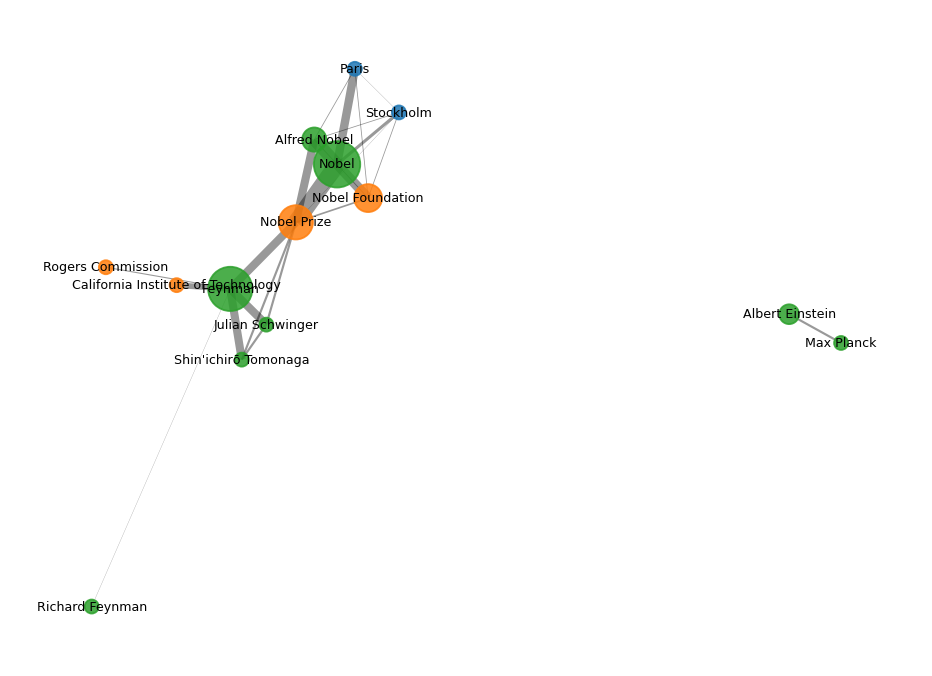

# Implicit Word Network

**A Python package for extracting and exploring (contextual) implicit entity networks from text corpora.**

Implicit entity networks represent a document collection as a cooccurrence
graph of named entities and terms: entities that are mentioned close to each
other are connected, and the strength of the relation decays with the distance
of the mentions. The model was introduced by Spitz & Gertz and powers
entity-centric corpus exploration tools such as [ECCE](https://doi.org/10.1145/3487553.3524237).



*Entity layer of the network extracted from the bundled example corpus (node size = mentions, edge width = ω).*

## Quick Start

### Installation

```bash
pip install implicit-word-network

# with spaCy NER
pip install "implicit-word-network[spacy]"
python -m spacy download en_core_web_sm

# with zero-shot GLiNER v2.5 NER
pip install "implicit-word-network[gliner]"
```

### Basic Usage

```python
from implicit_word_network import Corpus, GLiNEREntityExtractor, ImplicitNetworkPipeline

corpus = Corpus.from_txt("documents.txt")  # one document per line

extractor = GLiNEREntityExtractor(labels=["person", "organization", "location"])
pipeline = ImplicitNetworkPipeline(extractor, window=2)
network = pipeline.run(corpus, show_progress=True)

print(network.summary())
for edge in network.edges(top_k=10):
    print(edge.source.text, "--", edge.target.text, round(edge.weight, 2))

graph = network.to_networkx()  # continue with NetworkX
```

## Documentation

- [Getting Started](getting-started.md) - Installation and first steps
- [Theory](theory.md) - The implicit entity network model
- [Tutorials](tutorials/building-networks.md) - Building, querying, extracting, clustering, scaling
- [Examples](examples.md) - Scripts and an executed notebook
- [CLI Reference](cli.md) - Command-line interface
- [API Reference](api/index.md) - Complete API documentation
- [Development](development.md) - Contributing and development setup

## Author

- **Julian Schelb** - University of Konstanz

## Citation

If you use this package in your research, please cite the underlying models:

```bibtex
@inproceedings{schelb2022ecce,
  title     = {ECCE: Entity-centric Corpus Exploration Using Contextual Implicit Networks},
  author    = {Schelb, Julian and Ehrmann, Maud and Romanello, Matteo and Spitz, Andreas},
  booktitle = {Companion Proceedings of the Web Conference 2022 (WWW '22 Companion)},
  year      = {2022},
  doi       = {10.1145/3487553.3524237}
}

@inproceedings{spitz2016load,
  title     = {Terms over LOAD: Leveraging Named Entities for Cross-Document Extraction and Summarization of Events},
  author    = {Spitz, Andreas and Gertz, Michael},
  booktitle = {SIGIR '16},
  year      = {2016},
  doi       = {10.1145/2911451.2911529}
}

@inproceedings{spitz2018entangled,
  title     = {Exploring Entity-centric Networks in Entangled News Streams},
  author    = {Spitz, Andreas and Gertz, Michael},
  booktitle = {Companion of the The Web Conference 2018 (WWW '18 Companion)},
  year      = {2018},
  doi       = {10.1145/3184558.3188726}
}
```

## License

This project is licensed under the MIT License.
